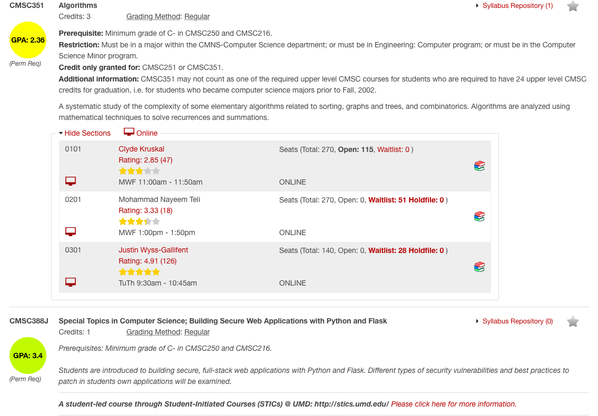

# UMDStats

This Google Chrome extension uses the PlanetTerp API to request information about a professor/course. It will then display the info on the UMD Schedule of Classes page. The average rating of the professor is displayed. The average GPA of the course is also displayed. A hyperlink will also appear, which links to reviews of the professor, if they exist on PlanetTerp. The extension calculates the average review by totaling all the available reviews and ratings on PlanetTerp and then dividing by the number of reviews. The average GPA is calculated similarly but with grade data instead.
 
 
The following is a link to the extension on the Google Web Store. (If it's not here, we are currently waiting for it to be accepted.)
Below you can find a picture of the extension in action! 
 
 
 
. 
  
  

